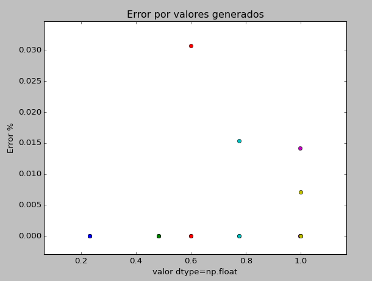

# MCOC-Proyecto-0
Perdida de significación
===============
A partir de los videos estudiados, podemos darnos cuenta de que la interpretación de números flotantes en un computador es diferente a la de numero enteros. El comportamiento de los códigos binarios en un computador tiene un numero de dígitos que representan de forma significativa su valor. Sin embargo, hay una cierta perdida de significancia que se genera, es por esto que se generó números al azar a través de Python por medio del comando random.random(), con el objetivo de utilizar el numero como un arreglo con un tipo de dato definido.

1.Arreglo con tipo de dato dtype=np.float16

2.Arreglo con tipo de dato dtype=np.float32.

3.Arreglo con tipo de dato dtype=np.float64.

Para cada uno de estos arreglos se evidencio la perdida de significación a partir del error que es calculado como:

Error (%) = (|Valor flotante como array - Valor aleatorio|) /( Valor aleatorio )

Además, se realizó el cálculo de la raíz cuadrada en cada caso con el fin de alterar los valores y ver su influencia en el error, comparándolos respecto al valor original obtenido a través del programa.

Resultados
==============

Podemos ver que a medida que aumenta el arreglo a trabajar el resultado es más exacto, esto se debe a que los dijitos del número flotante son mayores, entonces,  su error disminuye considerablemente, a continuación se puede ver de mejor forma como varia el error de acuerdo a un valor específico. 

Output de la consola:

Para el calculo del error se considera la siguiente formula :

Error (%) = [|Valor flotante como array - Valor aleatorio|]/[ Valor aleatorio ] 

Para el valor aleatorio:  0.232299727501  se encuentran los siguientes errores:

Error dtype=np.float16 es : 3.32271117658e-05 %

Error dtype=np.float32 es : 1.15397643724e-06 %

Error dtype=np.float64 es : 0.0 %

Para el valor aleatorio:  0.481974820401  con raiz cuadrada : 0.481974820401  se encuentran los siguientes errores:

Error dtype=np.float16 es : 1.66135545075e-05 %

Error dtype=np.float32 es : 5.76988217365e-07 %

Error dtype=np.float64 es : 0.0 %

Para el valor aleatorio:  0.599424726397  se encuentran los siguientes errores:

Error dtype=np.float16 es : 0.0308043020023 %

Error dtype=np.float32 es : 1.09880663472e-06 %

Error dtype=np.float64 es : 0.0 %

Para el valor aleatorio:  0.774225242676  con raiz cuadrada : 0.774225242676 se encuentran los siguientes errores:

Error dtype=np.float16 es : 0.0154009650525 %

Error dtype=np.float32 es : 5.4940332608e-07 %

Error dtype=np.float64 es : 0.0 %

Para el valor aleatorio:  0.996235130635  se encuentran los siguientes errores:

Error dtype=np.float16 es : 0.0141914926177 %

Error dtype=np.float32 es : 1.58836844219e-07 %

Error dtype=np.float64 es : 0.0 %

Para el valor aleatorio:  0.998115790194 con raiz cuadrada : 0.998115790194  se encuentran los siguientes errores:

Error dtype=np.float16 es : 0.00709599807478 %

Error dtype=np.float32 es : 7.94184213969e-08 %

Error dtype=np.float64 es : 0.0 % 
